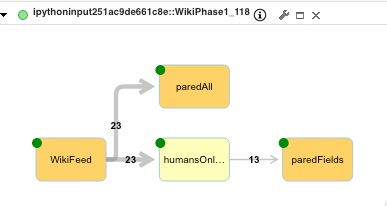
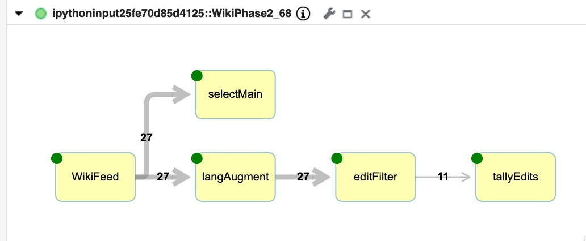
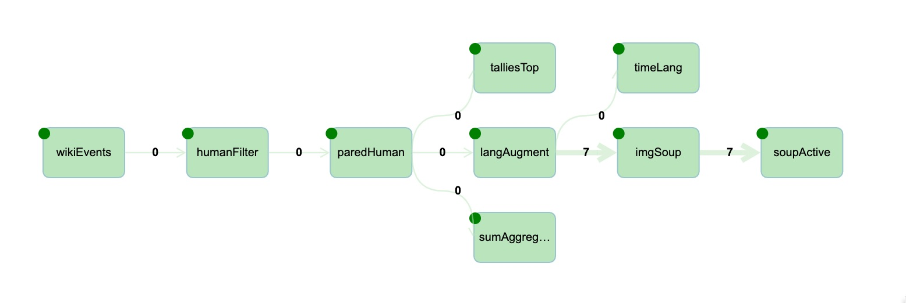
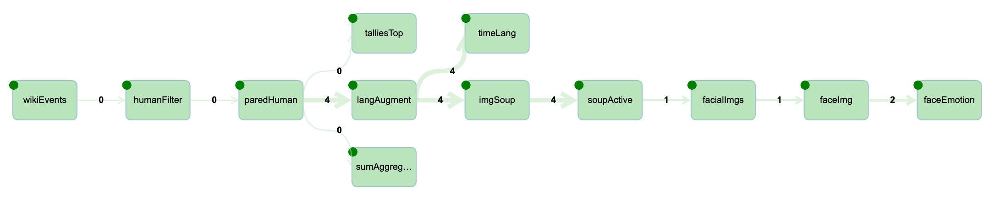

# ImageAnalysis Tutorial

This directory has a suite notebooks creates a Streams application that process live Wiki data. The inital notebook 
demonstrates connecting to a datasource (WikiPedia), discardsing upates and viewing the data in browser. The
final notebook demostrates analytises images being submitted to Wikipedia.

Each notebook composes, submits and renders the results as a standalone application. There
is no dependencies between notbooks. 

## Collection of links to Streams and ICP4D resources
- Wiki sse feed 
- Wiki explaination of feed
- [Invoking SPL operators](http://ibmstreams.github.io/streamsx.topology/doc/pythondoc/streamsx.spl.op.html#module-streamsx.spl.op)
- [Toplogy](http://ibmstreams.github.io/streamsx.topology/doc/pythondoc/streamsx.topology.topology.html?highlight=window#streamsx.topology.topology.Topology)

## imgAna_0
- Access the wikie data using SSE locally.
- Render type data in graph.

## imgAna_1

- Access the wiki data using SSE.
- Filter out messages that were generated by bots
- View the live data in notebook.

## imgAna_2 

Access the wiki data with the benifit of streams. 
- All functionality of WikiRecent1
- Normaize language of submitssion.
- Aggregate the top 10 submitters in the last 10 min
- Aggretate the top articles in the last submissions.
- Live view of top submitters, top articles and active languages in a 'dashboard'

## imgAna_3

- All functionality of WikiRecent2
- Ananlyse wiki update for image link
- Shred pages using Python package (beatifulsoup)  
- Live view of images submitted to wiki.

## imgAna_4

- All functionality of WikiRecent3
- Run images extracted in WikieRecent3 through the Facial Recognizer model and derive cropped facial image.
- Run cropped facial images through the Facial Emotion Classifier to generate a score.
- Live view of the orignal images, cropped images

