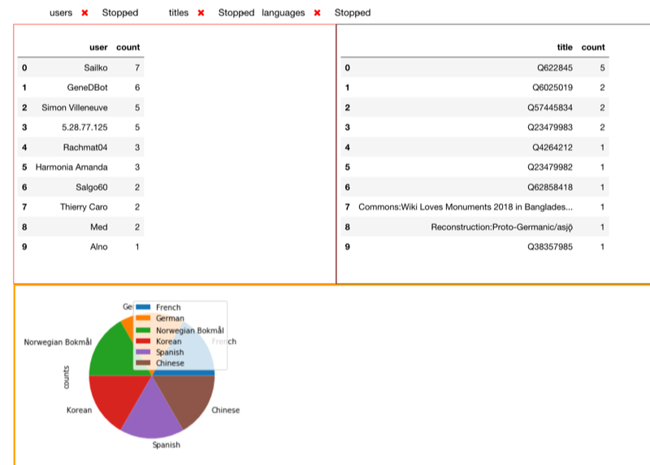
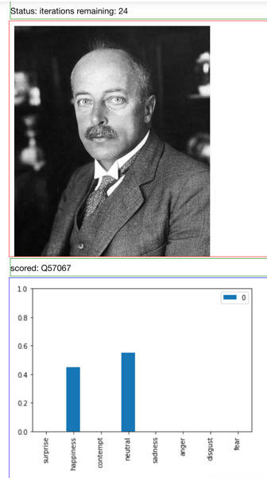

# sample.wikirecent
Examples and tutorials of live processing of Wikipedia recent updates feed

Wikipedia provides a realtime feed of recent updates to it's content. This repository contains examples and tutorials of live processing using this feed.

##  Juypter examples

Example of utilizing data derived solely from the feed, a dashboard snapshot showing top editors, articles and languages of updates in the last 30 seconds

Example of live image analysis, dashboard snapshot of image submitted to Wikipedia and the results of the 'Facial Emotion Classifier' graphed.
