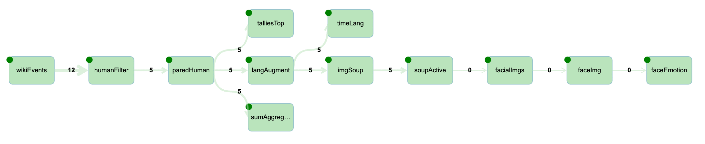

To get started, enter the Notebooks section and open the README notebook 
# sample.wikirecent
## Tutorials : live Wikipedia processing using Streams on ICP4D
### Wiki submitted images extracted for facial and emotion analysis using deep learning models.
Processing phases :
- connect to SSE feed for realtime Wikipedia updates
- drop 'robot' updates
- extract updates pertaining to images
- locate faces within image using facial analysis then crop
- score cropped images using emotional analysis   

Resulting in realtime categorization of content submitted to Wikiepedia, rendered in Juypter notebooks 
as illustrated below: 

In the example above the top photo was submitted to Wikipeida, on which a 'Facial Recognizer' located face(s), the UI inscribed a bounding.
The next row shows confidence level of the located faces, face percentage of the original image, followed by the cropped face. Finlly a pie chart
that is rendering the results of the 'Facial Emotion Classifier' scoring. 

In the case that no faces were located the subsequent processing is skipped.

## Juypter Notebooks extracts - details

Example of utilizing data derived solely from the feed, a dashboard snapshot 
showing top editors, articles and languages of updates in the last 30 seconds.
Refer to imgAna_2 notebook for details. 

Example of integrating the ['Facial Recognizer'](https://developer.ibm.com/exchanges/models/all/max-facial-recognizer/) into the Streams application . The Streams 
application is extracting the images submitted to Wikipedia, in this case someone submitted a classic movie poster. The image was run through the 'Facial Emotion Classfier'
and results rendered in a notebook where this still was captured. Refer to imgAna_4 notebook for details.

Example of using ['Facial Recognizer'](https://developer.ibm.com/exchanges/models/all/max-facial-recognizer/) 
in conjuntion with ['Facial Emotion Classifier'](https://developer.ibm.com/exchanges/models/all/max-facial-emotion-classifier/). The Streams
application extracts faces from images submitted to Wikipedia via the 'Facial Recognizer'. Streams pushes the face images to the 'Factial Emotion Classifier' 
for analysis, the results of which are rendered in a notebook where this still was captured. Refer to imgAna_4 notebook for details.
The emotions are rendered as pie chart here, when an emotion analysis does not return score the scale is displayed. 

### Getting started in ICP4D.
- Verify that you have 'Streams' add-on enabled. 
- Create a new 'Analytics project', from this Git repository. 
- Procede to the imgAna_1 notebook to walk through composing, building and submitting a Streams application in ICP4D.

### Notes
- Notebooks are functional on ICP4D and Cloud.
- Below is a capture of Streams application graph executing imgAna_4, numbers attached to connectors indicate message flow in the last seconds.

