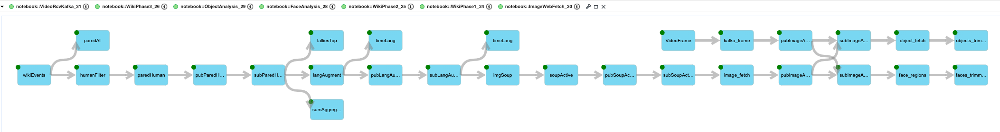
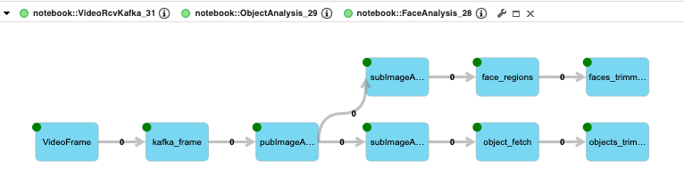

To get started, enter the Notebooks section and open the README notebook 
# sample.wikirecent
## Tutorials : live Wikipedia processing using Streams on ICP4D
### Wiki submitted images extracted for facial and object model analysis
Processing phases :
- connect to SSE feed for realtime Wikipedia updates
- drop 'robot' updates
- extract updates pertaining to images
- Use model to locate faces
- Use model to locate images

Resulting in realtime categorization of content submitted to Wikiepedia,

** Missing Image **

In the example photo was submitted to Wikipeida, on which a 'Facial Recognizer' located face(s), the UI inscribed a bounding.

In the case that no faces were located the subsequent processing is skipped.

## Juypter Notebooks extracts - details

Example of utilizing data derived solely from the feed, a dashboard snapshot 
showing top editors, articles and languages of updates in the last 30 seconds.
Refer to section 2? of wikiImageAnalysis notebook for details. 

Example of integrating the Object analysis Model  images submitted to Wikipedia, in this case someone submitted a classic movie poster. The image was run through the 'Facial Emotion Classfier'
and results rendered in a notebook where this still was captured. Refer to 5  notebook for details.

### Getting started in ICP4D.
- Verify that you have 'Streams' add-on enabled. 
- Create a new 'Analytics project', from this Git repository. 
- Proceed to the imgAna_1 notebook to walk through composing, building and submitting a Streams application in ICP4D.
- Alternate: Jump to the end to whet your appetite,  run the imgAna_Finale notebook to see live streaming analysis of Wiki data.

### Notes
- Current migrated to less cluttered version. 
 - The imgAna* notebooks have be colidated into the wikiImageAnalysis notebook.
 - The videoImageAnalsys notebook focuses on driving the two models with images provided by Kafka, it is a subset of the wikiImageAnalysis processing.
 - The videoToAnalysis notebook pushes video images 
- Notebooks are functional on ICP4D and Cloud.

The application graph generated by wikiImageAnalysis notebook. 

The application graph generated by videoImageAnalyis notebook. 
