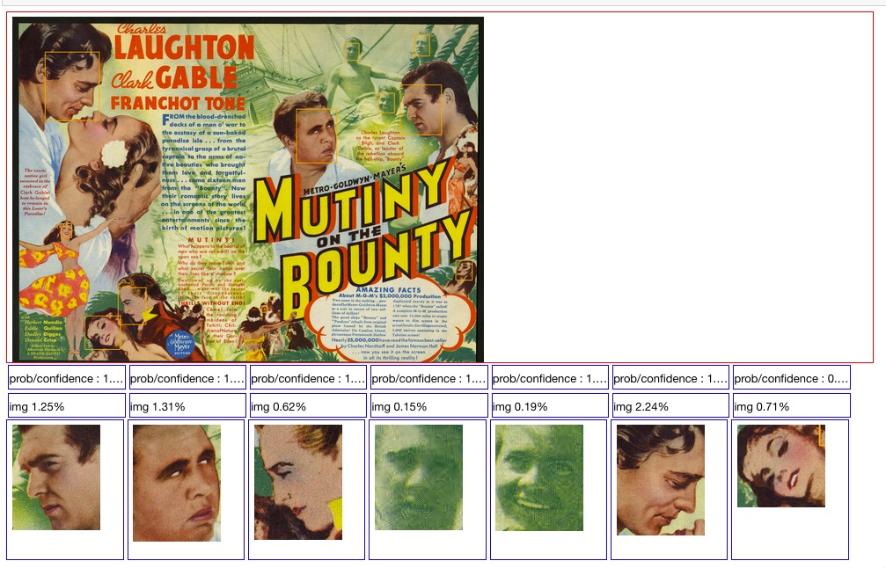

# sample.wikirecent
Examples and tutorials of live processing of Wikipedia recent updates feed.

Wikipedia provides a realtime feed of recent updates to it's content. This repository contains examples and tutorials of live processing using this feed.

##  Juypter examples

Example of utilizing data derived solely from the feed, a dashboard snapshot 
showing top editors, articles and languages of updates in the last 30 seconds.
Refer to Juypter/imgAna_2 notebook for details. 

Example of integrating the ['Facial Recognizer'](https://developer.ibm.com/exchanges/models/all/max-facial-recognizer/) into the Streams application . The Streams 
application is extracting the images submitted to Wikipedia, in this case someone submitted a classic movie poster. The image was run through the 'Facial Emotion Classfier'
and results rendered in a notebook where this still was captured. Refer to Juypter/imgAna_5_workbook() notebook for details.

Example of using ['Facial Recognizer'](https://developer.ibm.com/exchanges/models/all/max-facial-recognizer/) 
in conjuntion with ['Facial Emotion Classifier'](https://developer.ibm.com/exchanges/models/all/max-facial-emotion-classifier/). The Streams
application extracts faces from images submitted to Wikipedia via the 'Facial Recognizer'. Streams pushes the face images to the 'Factial Emotion Classifier' 
for analysis, the results of which are rendered in a notebook where this still was captured. Refer to Juypter/imgAna5 notebook for details.
The emotions are rendered as pie chart here, when an emotion analysis does not return score the color of he piechart is displayed. 

### work in process
- Notebooks are functional to me (Cloud & ICP4D) make them consumable for ICP4D.
- Progression is of understanding the data and building analysics 
- At this moment the goal is to have each notebook be standalone, all components to within the notebook. This may not be practical since notebook use
a significant portion of the previous notebook. 

